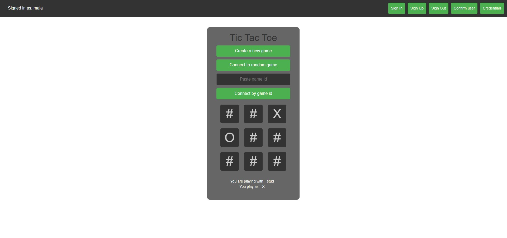
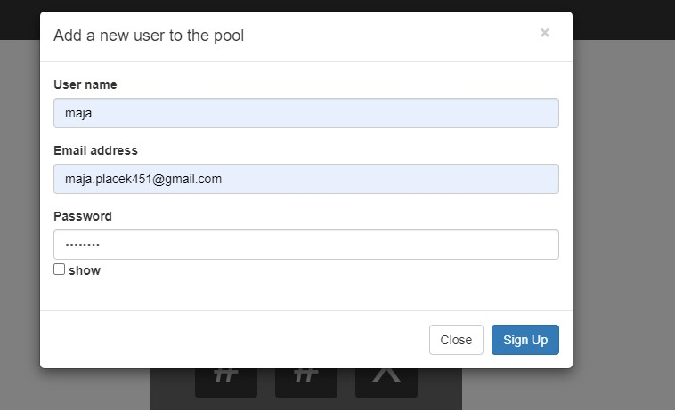
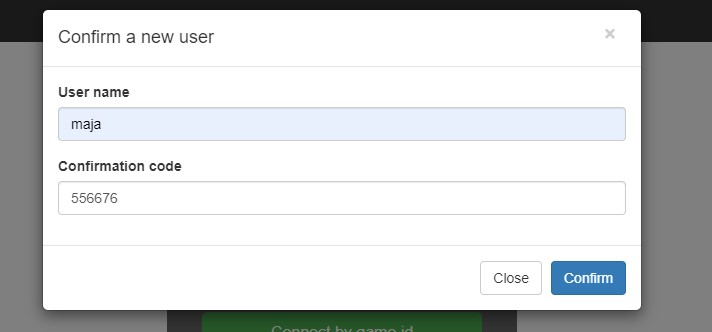
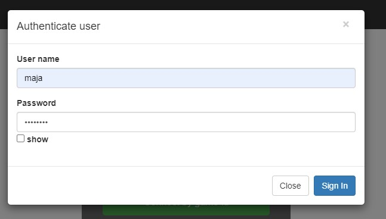

# Maja Placek - Cognito, TicTacToe report

- Course: *Cloud programming*
- Group: monday 9:15
- Date: 25.06.2024

## Environment architecture

#### Provider
- **Region**: `us-east-1`

#### Cognito User Pool
- **Name**: `AppPool`
- **Password Policy**:
  - Minimum length: 8
  - Require uppercase, lowercase, numbers, symbols
  - Temporary password validity: 7 days
- **Deletion Protection**: `INACTIVE`
- **Schema Attributes**:
  - Various attributes like `profile`, `address`, `birthdate`, `gender`, `email`, etc.
  - Attributes are mostly mutable and optional
  - String attributes have max length constraints (2048)
- **Auto-Verified Attributes**: `email`
- **Verification Message Template**: `CONFIRM_WITH_CODE`
- **User Attribute Update Settings**: Verification required for email updates
- **MFA Configuration**: `OFF`
- **Email Configuration**: Sending account is `COGNITO_DEFAULT`
- **Admin Create User Config**: 
  - Admin create user only: `false`
  - Custom invite message templates
- **Username Configuration**: Case insensitive
- **Account Recovery**: Prioritizes verified email

#### Cognito User Pool Client
- **Name**: `public client`
- **User Pool ID**: References `test_pool`
- **Generate Secret**: `false`
- **Token Validity**:
  - Refresh token: 30 days
  - Access token: 60 minutes
  - ID token: 60 minutes
- **Attributes**:
  - Read/Write: `address`, `birthdate`, `email`, `family_name`, `gender`, etc.
- **Auth Flows**: 
  - ALLOW_REFRESH_TOKEN_AUTH, ALLOW_USER_PASSWORD_AUTH, ALLOW_USER_SRP_AUTH
- **OAuth Settings**: Not enabled
- **Error and Token Settings**:
  - Prevent user existence errors: `ENABLED`
  - Token revocation: `true`
  - Auth session validity: 3 hours

## Preview

Screenshots of configured AWS services. Screenshots of your application running.

## Reflections

- What did you learn?
    - I learned how to integrate AWS Cognito into an existing project, leveraging its user management and authentication capabilities. This included setting up a new User Pool, configuring policies, and creating App Clients to facilitate secure interactions between the frontend and backend. In the future I would like to explore further functionalities of Cognito.
- What obstacles did you overcome?
    - passing the token to backend. This was crucial to ensure that only authenticated users could access certain backend resources and functionalities. I used the amazon-cognito-identity-js library to handle the authentication flow and retrieve these tokens. Also, I had to analize how to build a proper header for this to succeed.
    - easy assignment in comparison to previous ones
- What did you help most in overcoming obstacles?
    - internet resources
      - https://www.youtube.com/watch?v=QKxTGcJHar0
      - https://www.npmjs.com/package/amazon-cognito-identity-js
- Was that something that surprised you?
  - easy intergation into both .NET and js
  - extensive security features offered by AWS Cognito
